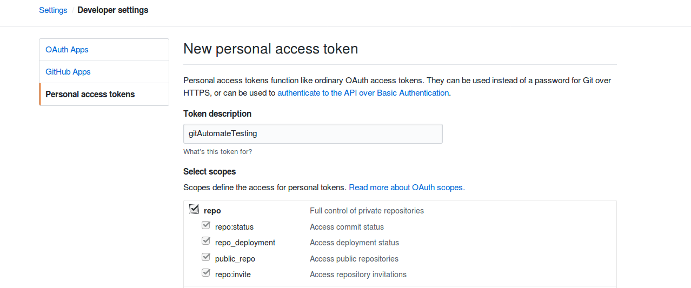
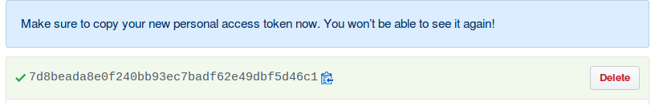

# gitAutomatePush

## To track your files and push automatically to your github repo . 

### Ingredients:
1. Repo name 
2. User name 
3. Filepath to track (the file)
4. Default Commit Message 
5. Mainly , Oauth Token . [you can get it from here](https://github.com/settings/tokens)

### PROCEDURE FOR GETTING TOKEN > 
Navigate to https://github.com/settings/tokens . Then click on <i> generateNewToken</i> . You will be prompted by , 



Then click on repo Radio button for permission to access the repo . 

Then you will get a token . <b> Make sure you copy it some where . </b> bcoz its the last time you are seeing it . 



Hurray !! You got the Token . 

### Cooking Procedure . 
1. Open gitAutoPush.py file . 
2. Edit all the necessary details such as , 


```python
        self.filename = 'tes_file.txt' # Your file name 
        self.git_repo_name = 'gitAutomatePush' #Do not include .git extension
        self.git_user_name = 'syedjafer' # username 
        self.git_oauth_token = '<Your Auth Token>' # Your Auth Token
        self.git_commit_msg = 'Update the file' # Your Commit Message
```

3. This snippet will track the file for changes using the timestamp . If it encounters with a change in timestamp (Means there is a change in the content of the file and its ready to be pushed ) . It will add the file in the git and commir it with the default commit message . 

4. Problem of providing the username and password (here we used oauth token) is been smashed with the inline specification in 
```python
os.system("git push https://%s:%s@github.com/%s/%s.git"%(	self.git_user_name,self.git_oauth_token,self.git_user_name,self.git_repo_name))
```

### Time to Serve 
There are two ways of running this program . 

1. You can put it in the cronjob , (so that it will be triggered for every fiveminutes or your time specification )

2. Run the program infinite times. :stuck_out_tongue:
